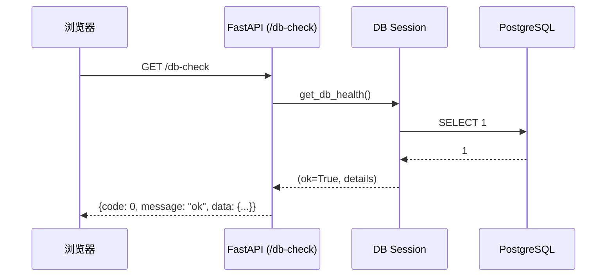

# 架构说明（初稿）

本文档描述 LPS Creativ 项目的整体架构与分层设计。
随着功能增加，会不断补充和细化。

## 1. 总体目标

LPS Creativ 是一个“FB 广告落地页生成系统”：

- 从公司现有的视频素材系统获取热门视频
- 让美工选择视频与模板，自动生成落地页 HTML
- 支持将落地页与广告图打包下载，提供给投流同事

该系统只负责“生成与打包”，不直接管理投放平台上的素材配置。

## 2. 系统组成模块（高层）

从逻辑层面，系统可分为三大模块：

1. 视频与模板管理
   - 视频素材库（导入 / 查询）
   - 落地页模板库（上传 / 管理）
2. 落地页工作流
   - 工作流批次列表
   - 创建落地页流程（选视频 / 选模板 / 生成）
   - 上传广告图与状态流转
3. 投流计划与下载中心
   - 选择 ready 状态的批次
   - 按渠道/地区生成下载包

本文档当前阶段主要关注后端整体架构。

## 3. 后端架构（当前阶段）

后端采用 Python + FastAPI + PostgreSQL。
为了便于扩展和维护，我们采用经典的分层结构：

- API 层（Router / Controller）
  - 定义 URL 路由和 HTTP 方法
  - 只做参数解析、调用业务服务，不直接访问数据库
  - 返回统一格式的 JSON 响应

- 服务层（Service）
  - 承载业务逻辑
  - 不关心 HTTP 细节
  - 组合调用多个仓储 / 外部 API

- 仓储层（Repository / DAO）
  - 封装对数据库的访问（通过 SQLAlchemy）
  - 每个实体（如 video, template, workflow）有对应的仓储类

- 数据访问层（SQLAlchemy + PostgreSQL）
  - 定义 ORM 模型（表结构）
  - 通过 Alembic 管理迁移

当前代码中已经存在的部分：

- `app/main.py`：应用入口，注册基础路由
- `app/core/config.py`：配置加载（.env / 环境变量）
- `app/db/base.py`：SQLAlchemy Base 与模型收集
- `app/db/models.py`：所有核心实体的 ORM 模型定义
- `app/db/session.py`：数据库引擎、Session 工厂与健康检查
- `migrations/`：Alembic 迁移脚本（当前已创建一版核心表结构迁移）

## 4. 数据流示意（从浏览器到数据库）

以“数据库健康检查 `/db-check`”为例：



未来业务接口的数据流也是类似结构：

1. 浏览器调用某个 API（带参数）
2. API 层解析参数，调用对应服务
3. 服务层调用仓储层执行数据库读写 / 调用外部视频 API
4. 服务层将结果组装成业务对象
5. API 层将结果封装成统一 JSON 返回

## 5. 配置与环境管理

配置通过以下方式管理：

- `.env` 文件：存放本地开发环境的私密配置（数据库 URL 等）
- 环境变量：在正式环境中使用（避免提交敏感信息到代码仓库）
- `app/core/config.py`：
  - 使用 `python-dotenv` 加载 `.env`
  - 使用 Pydantic 定义 `Settings` 模型
  - 提供 `get_settings()` 供其他模块读取配置

好处：

- 所有配置项集中管理，类型明确
- 缺少关键配置时，在应用启动或首次访问相关功能时给出清晰错误

## 6. 返回格式与错误处理（约定概要）

为了便于前端统一处理，所有接口的返回结构遵循统一格式：

- 成功：

```json
{
  "code": 0,
  "message": "ok",
  "data": { /* 具体数据 */ }
}
```

- 失败（业务或系统错误）：

```json
{
  "code": 1,
  "message": "错误原因（英文或中文皆可）",
  "data": {
    "details": "更详细的错误说明（可选）"
  }
}
```

当前阶段 `/health` 与 `/db-check` 已经遵守此约定。

后续在 `LPS/docs/接口约定.md` 中会详细列出：

- 常见错误码含义
- 各模块接口的请求 / 响应字段
