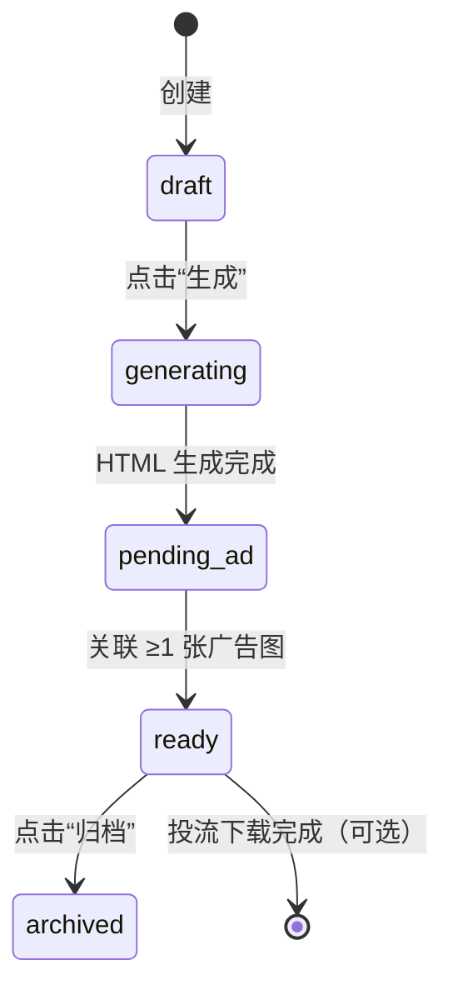
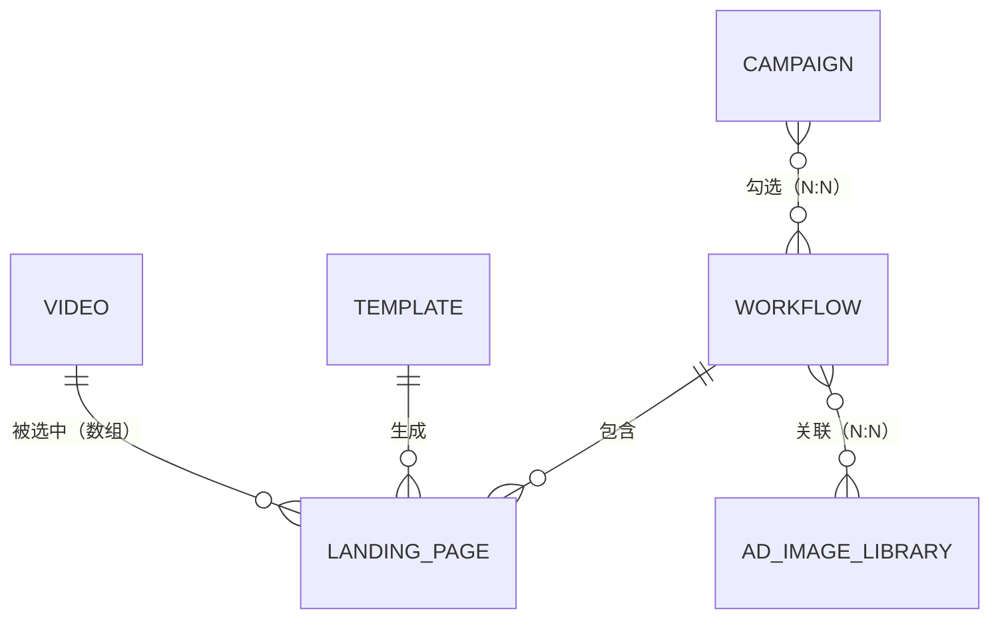

# 📌 LPS_Creativ 系统核心蓝图（V1.4 最终锁定版）

**文档用途**：在任何新会话讨论时，优先粘贴本文档作为上下文基准，避免重复提问和逻辑漂移。

---

## 1. 系统导航结构（核心定位）

LPS_Creativ 系统（FB 广告落地页快速生成系统）

```
主界面三板块：
├─ 1. 影片素材库（增删改查 + 一键导入 API）
├─ 2. 落地页工作流（核心页面：生成能力）
│   ├─ 2.1 工作流列表：展示历史批次
│   │   ├── 状态标签：generating / pending_ad / ready / archived
│   │   └── 操作按钮：根据状态动态显示（上传 / 下载 / 归档）
│   │
│   └─ 2.2 创建落地页（多步骤表单）
│       ├── Step 1：勾选视频素材（多选，数量受模板 max_videos 限制）
│       ├── Step 2：选择模板（单选或多选，每个模板生成独立落地页）
│       ├── Step 3：点击“生成”→ 后端异步渲染 → 完成后自动跳回 2.1 列表
│       └── 结果：新批次显示在列表顶部，状态为 **pending_ad**
│
│   [新增] 2.3 批次详情页
│       ├── 展示该批次所有落地页 HTML
│       ├── 展示已关联的广告图数量
│       └── 操作：[+ 从素材库选择图片] / [+ 本地上传新图片]
│
└─ 3. 投流计划（下载中心）
    ├─ 3.1 新建计划：勾选 ready 状态的工作流批次 → 配置渠道 / 地区 → 打包下载
    └─ 3.2 历史记录：历史投流计划列表
```

**系统边界**：只负责生成与打包，不管理投流阶段的素材匹配逻辑。

---

## 2. 核心业务流程（不可变更）

- **创建与生成**：美工创建工作流批次 → 勾选视频 → 选择模板 → 点击“生成” → 状态变为 `pending_ad`
- **上传素材**：美工进入 `pending_ad` 批次详情 → 从全局素材库关联广告图（≥1 张）→ 状态变为 `ready`
- **投流计划**：投流同事创建投放计划 → 勾选 `ready` 批次 → 配置渠道 / 地区 → 下载批次包
- **下载内容**：批次 ID 目录包含所有落地页 HTML + 关联广告图（具体使用由投流同事决定）

### 状态流转（显式 `pending_ad`）



---

## 3. 实体关系图（ER）



**关系说明**
- VIDEO ↔ LANDING_PAGE：多对多（`selected_video_ids` 数组）
- TEMPLATE ↔ LANDING_PAGE：一对多（单模板生成多个落地页）
- WORKFLOW ↔ LANDING_PAGE：一对多（批次包含多个落地页）
- WORKFLOW ↔ AD_IMAGE_LIBRARY：多对多（`workflow_ad_map` 中间表）
- CAMPAIGN ↔ WORKFLOW：多对多（`campaign_workflow_map` 中间表）

---

## 4. 表结构设计（完整版）

### 实体 1：`video`（视频素材库）

```sql
CREATE TABLE IF NOT EXISTS video (
    id BIGINT PRIMARY KEY GENERATED ALWAYS AS IDENTITY,
    external_id VARCHAR(64),
    title VARCHAR(255) NOT NULL,
    category VARCHAR(50),
    poster_url TEXT NOT NULL,
    view_count BIGINT DEFAULT 0,
    metadata JSONB DEFAULT '{}',
    status VARCHAR(20) DEFAULT 'active',
    created_at TIMESTAMP DEFAULT NOW(),
    updated_at TIMESTAMP DEFAULT NOW()
);

CREATE UNIQUE INDEX idx_video_external_id ON video(external_id);
CREATE INDEX idx_video_category ON video(category);
CREATE INDEX idx_video_status ON video(status);
```

### 实体 2：`template`（落地页模板库）

```sql
CREATE TABLE IF NOT EXISTS template (
    id BIGINT PRIMARY KEY GENERATED ALWAYS AS IDENTITY,
    name VARCHAR(100) NOT NULL,
    description TEXT,
    thumbnail_url TEXT,
    html_file_path TEXT NOT NULL,
    max_videos INT NOT NULL,
    static_assets_path TEXT,
    status VARCHAR(20) DEFAULT 'active',
    created_at TIMESTAMP DEFAULT NOW()
);
```

### 实体 3：`workflow`（工作流 / 批次实例）

```sql
CREATE TABLE IF NOT EXISTS workflow (
    id BIGINT PRIMARY KEY GENERATED ALWAYS AS IDENTITY,
    name VARCHAR(200) NOT NULL,
    status VARCHAR(30) NOT NULL,
    created_by VARCHAR(100) NOT NULL,
    created_at TIMESTAMP DEFAULT NOW(),
    updated_at TIMESTAMP DEFAULT NOW()
);

CREATE INDEX idx_workflow_creator ON workflow(created_by);
CREATE INDEX idx_workflow_status ON workflow(status);
```

### 实体 4：`landing_page`（落地页实例）

```sql
CREATE TABLE IF NOT EXISTS landing_page (
    id BIGINT PRIMARY KEY GENERATED ALWAYS AS IDENTITY,
    workflow_id BIGINT NOT NULL REFERENCES workflow(id) ON DELETE CASCADE,
    template_id BIGINT NOT NULL REFERENCES template(id),
    selected_video_ids BIGINT[] NOT NULL,
    generated_page_url TEXT NOT NULL,
    created_at TIMESTAMP DEFAULT NOW(),
    UNIQUE(workflow_id, template_id)
);

CREATE INDEX idx_landing_page_workflow ON landing_page(workflow_id);
CREATE INDEX idx_landing_page_template ON landing_page(template_id);
```

### 实体 5：`ad_image_library`（广告素材总库）

```sql
CREATE TABLE IF NOT EXISTS ad_image_library (
    id BIGINT PRIMARY KEY GENERATED ALWAYS AS IDENTITY,
    file_url TEXT NOT NULL,
    file_name VARCHAR(255),
    dimensions VARCHAR(20),
    file_size INT,
    author VARCHAR(100) NOT NULL,
    upload_batch VARCHAR(50),
    status VARCHAR(20) DEFAULT 'active',
    created_at TIMESTAMP DEFAULT NOW()
);

CREATE INDEX idx_ad_image_author ON ad_image_library(author);
CREATE INDEX idx_ad_image_batch ON ad_image_library(upload_batch);
```

### 实体 6：`workflow_ad_map`（批次与素材关联）

```sql
CREATE TABLE IF NOT EXISTS workflow_ad_map (
    workflow_id BIGINT NOT NULL REFERENCES workflow(id) ON DELETE CASCADE,
    ad_image_id BIGINT NOT NULL REFERENCES ad_image_library(id) ON DELETE CASCADE,
    PRIMARY KEY (workflow_id, ad_image_id)
);

CREATE INDEX idx_wam_workflow ON workflow_ad_map(workflow_id);
CREATE INDEX idx_wam_ad_image ON workflow_ad_map(ad_image_id);
```

### 实体 7：`campaign`（投放计划）

```sql
CREATE TABLE IF NOT EXISTS campaign (
    id BIGINT PRIMARY KEY GENERATED ALWAYS AS IDENTITY,
    name VARCHAR(200) NOT NULL,
    channels TEXT[] NOT NULL,
    regions TEXT[] NOT NULL,
    launch_time TIMESTAMP,
    status VARCHAR(20) DEFAULT 'active',
    created_by VARCHAR(100) NOT NULL,
    created_at TIMESTAMP DEFAULT NOW(),
    config JSONB DEFAULT '{}'
);

CREATE INDEX idx_campaign_creator ON campaign(created_by);
```

### 实体 8：`campaign_workflow_map`（投放计划关联表）

```sql
CREATE TABLE IF NOT EXISTS campaign_workflow_map (
    campaign_id BIGINT NOT NULL REFERENCES campaign(id) ON DELETE CASCADE,
    workflow_id BIGINT NOT NULL REFERENCES workflow(id) ON DELETE CASCADE,
    PRIMARY KEY (campaign_id, workflow_id)
);

CREATE INDEX idx_cwm_campaign ON campaign_workflow_map(campaign_id);
CREATE INDEX idx_cwm_workflow ON campaign_workflow_map(workflow_id);
```

---

## 5. 级联删除策略

| 删除操作               | 被删除表            | 自动清理关联表                  | 保留表                                   | 说明                                                         |
|------------------------|---------------------|---------------------------------|------------------------------------------|--------------------------------------------------------------|
| `DELETE FROM workflow` | workflow            | landing_page, workflow_ad_map   | ad_image_library, campaign_workflow_map | 批次删除，落地页与关联关系清理，素材库保留                   |
| `DELETE FROM ad_image_library` | ad_image_library | workflow_ad_map                | workflow, landing_page                   | 删除素材，清理所有关联关系                                   |
| `DELETE FROM campaign` | campaign            | campaign_workflow_map           | workflow, landing_page, ad_image_library | 删除投放计划，批次及素材不受影响                            |

---

## 6. API 契约摘要（新增）

| 模块     | 接口 | 方法 | 请求体 | 响应体 | 状态码 |
|----------|------|------|--------|--------|--------|
| 视频素材 | 查询视频 | GET /api/videos | category, page | `{total, items: [{id, title, poster_url, category, view_count, updated_at}]}` | 200 |
|          | 导入 API | POST /api/videos/sync | start_date, end_date, limit | `{imported_count, updated_count}` | 200 |
|          | 上传封面 | POST /api/videos/{id}/poster | `file` | `{poster_url}` | 200 |
| 模板管理 | 查询模板 | GET /api/templates | - | `[{id, name, max_videos, thumbnail_url}]` | 200 |
|          | 上传模板 | POST /api/templates | `{name, html_file}` | `{id}` | 201 |
| 工作流核心 | 创建批次 | POST /api/workflows | `{name}` | `{id, status: "draft"}` | 201 |
|          | 生成落地页 | POST /api/workflows/{id}/generate | `{video_ids[], template_ids[]}` | `{workflow_id, landing_pages: [{id, url}]}` | 202 |
|          | 查询批次 | GET /api/workflows/{id} | - | `{id, name, status, landing_pages[], ad_images[]}` | 200 |
| 广告素材 | 本地上传 | POST /api/ad-images/upload | `file` | `{id, file_url}` | 201 |
|          | 关联到批次 | POST /api/workflows/{id}/ad-images | `{ad_image_ids[]}` | `{mapped_count}` | 200 |
|          | 查询素材库 | GET /api/ad-images | `author, batch` | `{total, items: [{id, file_url}]}` | 200 |
| 投流计划 | 创建计划 | POST /api/campaigns | `{name, channels[], regions[]}` | `{id}` | 201 |
|          | 关联批次 | POST /api/campaigns/{id}/workflows | `{workflow_ids[]}` | `{mapped_count}` | 200 |
|          | 下载批次包 | GET /api/campaigns/{id}/download | - | `{download_url}` | 200 |

---

## 7. 设计决策锁定（不可推翻）

- 核心价值：快速生成落地页（视频素材 + 模板 → HTML）
- 数据流：批次化组织，所有数据归属于 `workflow`，下载时按批次打包
- 状态管理：`workflow.status` 是唯一状态源，投流只操作 `ready` 批次
- 模板选择：支持多模板，每个模板对应独立 `landing_page`
- 广告图管理：独立全局素材库 `ad_image_library`，与 `workflow` 为 N:N
- 下载结构：`批次ID/` 目录包含所有落地页 HTML + 关联广告图
- 删除安全：删除 `workflow` 不影响素材库，只删除 `workflow_ad_map` 关联
- 状态流转：必须显式经历 `pending_ad`，生成后不可跳过待上传阶段

---
所用的数据库为MySQL 数据名字:"lps_creativ"  数据库账户"laoluo666"   数据库密码"laoluo666"
## 8. 使用指南

下次开新会话时，复制以下模板作为开头：

```
请基于 LPS_Creativ 蓝图 V1.4（ad_image_library + 显式 pending_ad 版）讨论 [具体模块]：

--- 粘贴上面整个文档 ---

我的问题是：[具体需求]
```

**重要提醒**：本蓝图已锁定素材复用逻辑与显式 `pending_ad` 流转，后续讨论不可推翻，其他接口细节可优化。
